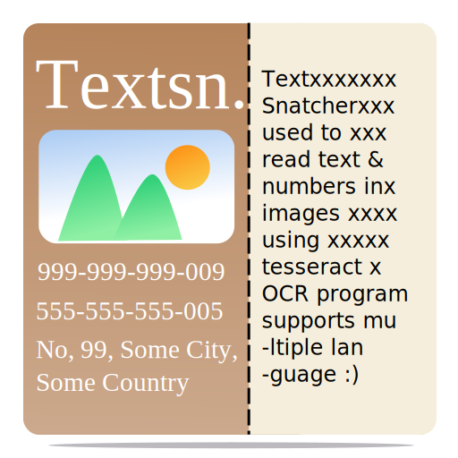

[](https://wiki.gnome.org/Projects/Vala)


<div align="center">

<h1>TextSnatcher</h1>
<p>Copy Text from Images with ease, Perform OCR operations in seconds.</p>

</div>

## Download

<div align="center">
  <a href='https://flathub.org/apps/details/com.github.rajsolai.textsnatcher'></a></br>
<a href="https://appcenter.elementary.io/com.github.rajsolai.textsnatcher"></a>
</div>

## Features
- Multiple Language Support.
- Copy Text from images with a Drag.
- Drag over any Image and Paste.
- Fast and Easy to Use.
- This application uses the Tesseract OCR 4.x for the character
recognition.
- Read more about [Tesseract](https://tesseract-ocr.github.io/tessdoc/Home.html) and Star ⭐️ [Tesseract-Project](https://github.com/tesseract-ocr/tesseract).

## Screencasts


https://user-images.githubusercontent.com/54436424/152921719-228485ba-0d37-4b01-864e-63a2792248b5.mp4


https://user-images.githubusercontent.com/54436424/152921736-c9567c9d-0afa-4c09-8706-6b2a1b6b635a.mp4


## Screenshots


## Support Me

<a href="https://www.buymeacoffee.com/rajsolai" target="_blank"></a>

[](https://ko-fi.com/R6R7ABG0F)


## Social Media Posts

[LinkedIn Post on Why I created TextSnatcher](https://www.linkedin.com/posts/solai085_linux-commentbelow-apple-activity-6826408004519374848-wxsw)

## Dependencies

Ensure you have these dependencies installed

### Runtime Dependency
-   scrot
-   tesseract-ocr
-   tesseract language data
    [arch repos](https://archlinux.org/packages/community/x86_64/tesseract)
    [debian repos](https://packages.debian.org/search?keywords=tesseract-ocr)

### Buildtime Dependency
-   granite
-   gtk+-3.0
-   gobject-2.0
-   gdk-pixbuf-2.0
-   libhandy-1
-   libportal-0.5

## Install, build and run

```bash
# clone repository
git clone https://github.com/RajSolai/TextSnatcher.git TextSnatcher
# cd to dir
cd TextSnatcher
# run meson
meson build --prefix=/usr
# cd to build, build and test
cd build
sudo ninja install && com.github.rajsolai.textsnatcher
```

## Inspirations

- ReadMe: https://github.com/alainm23/planner
- Application Structure: https://github.com/alcadica/develop
- TextSniper (MacOS Application)

Made with ❤️ for Linux
